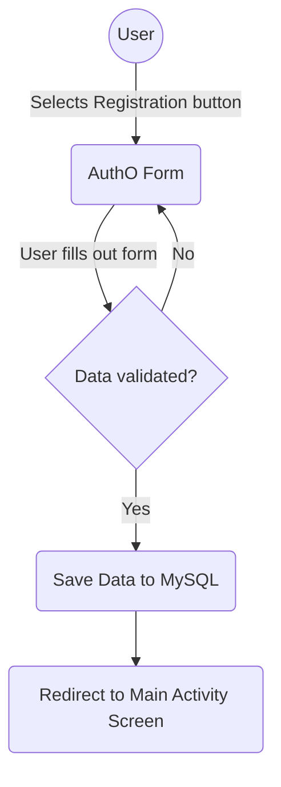
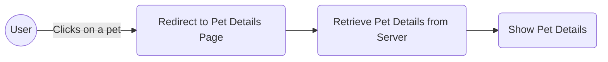
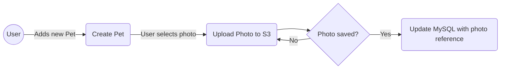
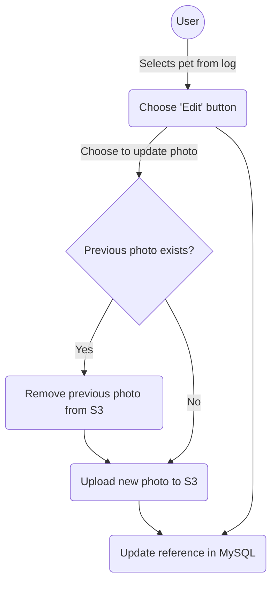
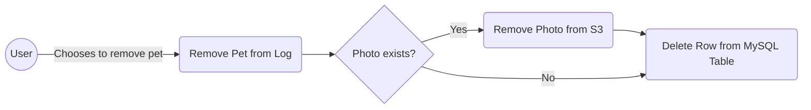

# Pawsense
This app is for helping pet parents better track their pets' behavior, mood, and health, and find solutions to any existing problems so their pets can live their best lives.

## Table of Contents

- [Approach](#approach)
- [Features and Functionality](#features)
- [Stack](#stack)
- [Diagrams](#diagrams)

<a name="approach"></a>

## Approach
Since animals cannot communicate the way that we can, it is important for pet parents to regularly keep track of their pets behavior, mood and any other changes that could point to health problems. By the time something serious happens and a pet is taken to the vet, sometimes it is too late and your pet has to have invasive surgery or worse.

Users will have the ability to track their pet's behavior, mood, and more so that they can better detect these serious illnesses later on before it's too late.

<a name="features"></a>

## Features and Functionality:
Once a user is authenticated, they are directed to a page on the app that shows them an overview of the pets in their household. They can do the following:

- Add new pet
- Edit pet's details
- Access pet's details
- Remove a pet
- Log the pet's daily activities, behaviors, moods, and more.

<a name="stack"></a>

## Stack
The frontend and back end are separate from each other since both have different programming languages and frameworks.

### Frontend
- Next.js (Client)
- Tailwind.css(Styling)
- Clerk Dev (Authentication/Authorization)

### Backend
- Spring Boot (Server)
- PostgreSQL (Database)
- Cloudinary (File Storage)

<a name="diagrams"></a>

## Diagrams

### New User Registration


### Get Pet Details


### Add a new pet to the household


### Edit Pet Details


### Pet removed from household



## Prerequisites and Running Locally
Before running this project locally you'll need the following
- Node.js (version 18+)
- JDK 17
- Maven
- PostgreSQL(version 14+)
- Clerk Dev account
- Cloudinary account

First, clone this repository

Second open the pawsense-backend directory from the root directory of the project and added the following to application.properties:

```application.properties

# PostgreSQL configuration
spring.datasource.url=jdbc:postgresql://localhost:5432/pawsense #this can stay the same or you can changing to what you want
spring.datasource.username= 
spring.datasource.password=
spring.jpa.show-sql=true

# Update the dialect for PostgreSQL
spring.jpa.properties.hibernate.dialect=org.hibernate.dialect.PostgreSQLDialect

# Hibernate Settings
spring.jpa.hibernate.ddl-auto=update

spring.devtools.add-properties=false
spring.security.user.password=none
#spring.autoconfigure.exclude=org.springframework.boot.autoconfigure.security.servlet.SecurityAutoConfiguration

-Djps.track.ap.dependencies=true


# JWT - can be found under the clerk application you created for this project
clerk.audience=
spring.security.oauth2.resourceserver.jwt.issuer-uri=
spring.security.oauth2.resourceserver.jwk-set-uri=

spring.main.allow-bean-definition-overriding=true
client.url=http://localhost:3000

```

You can now run and build by running the following command:
```bash
  mvn spring-boot:run
```

Now go to the frontend directory from the root directory and add the following to .env.local file:

```.env.local
#this variable should change to true when deploying to Vercel
IS_PRODUCTION=false

#can find both under API keys tab
NEXT_PUBLIC_CLERK_PUBLISHABLE_KEY=
CLERK_SECRET_KEY=

# does not need to be changed but if you want to, you can update them here and under the Paths tab
NEXT_PUBLIC_CLERK_SIGN_IN_URL=/sign-in
NEXT_PUBLIC_CLERK_SIGN_UP_URL=/sign-up
NEXT_PUBLIC_CLERK_AFTER_SIGN_IN_URL=/dashboard
NEXT_PUBLIC_CLERK_AFTER_SIGN_UP_URL=/dashboard
NEXT_PUBLIC_EXTERNAL_API=http://localhost:8080

# find under the "Set Up Work Environment" section located on Get Started tab
NEXT_PUBLIC_CLOUDINARY_CLOUD_NAME=dwvdml8mi
# find and/or add an unsigned upload preset under the settings of your Cloudinary application
NEXT_PUBLIC_UPLOAD_PRESET=jpttrz2h

```
  

## Possible Future Features and Functionality
- Curated articles recommended to users based on changes in their pet's personality and stats(lifestyle, age, diet)
- Onboarding: It never hurts to ensure that a user understands the app and its features instead of letting them figure it out on their own
- Share Pet Profile: Share certain information about your pet with caretakers, vets, and groomers.
