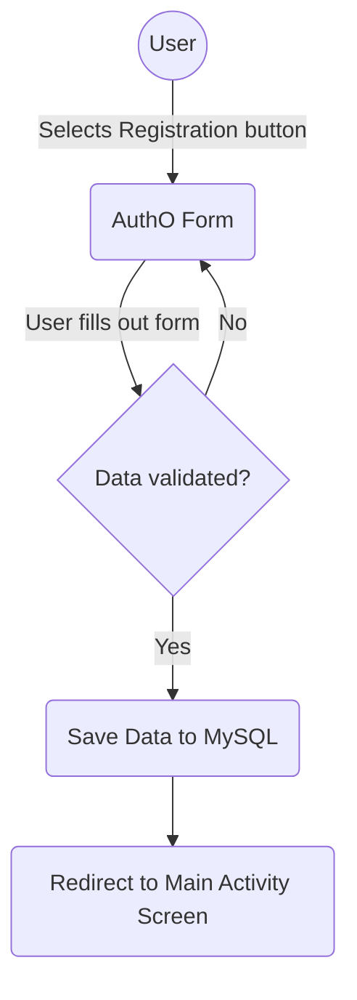
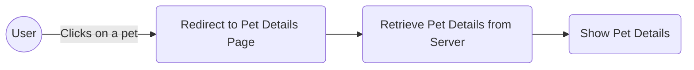
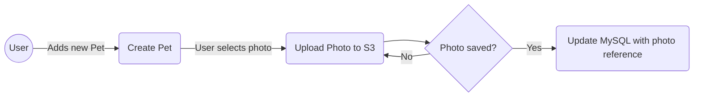
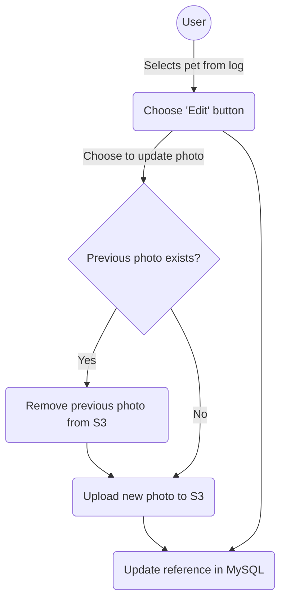
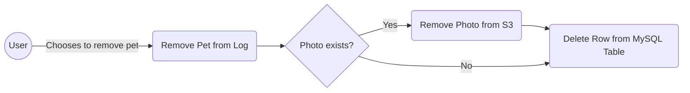

# Pawsense
This app is for helping pet parents better track their pets' behavior, mood and health, find solutions to any existing problems so their pets can live their best life.

## Table of Contents

- [Approach](#approach)
- [Features and Functionality](#features)
- [Stack](#stack)
- [Diagrams](#diagrams)

## Approach
Since animals cannot communicate the way that we can, it is important for pet parents to regularly keep track of their pets behavior, mood and any other changes that could point to health problems. By the time something serious happens and a pet is taken to the vet, sometimes it is too late and your pet has to have invasive surgery or worse.

Users will have the ability to track their pets behavior, mood and more so that they can better detect these serious illnesses later on before it's too late.

## Features and Functionality:
Once a user is authenticated, they are directed to a page on the app that shows them an overview of the pets in their household. They can do the following:

- Add new pet to household
- Edit pet's details
- Access pet's details
- Archive a pet that is no longer apart of household
- Log pet's daily activities, behaviors, moods and more.

## Stack
The frontend and backend are separate from each other since both have different programming languages and frameworks.

### Frontend
- Next.js (client)
- Tailwind.css(styling)
- Cypress(e2e testing)

### Backend
- Spring Boot (server)
- MySQL (database)
- JUnit (unit testing)

### Auth
- Auth0

## Diagrams

### New User Registration

### Get Pet Details

### Add new pet to household

### Edit Pet Details

### Pet removed from household

